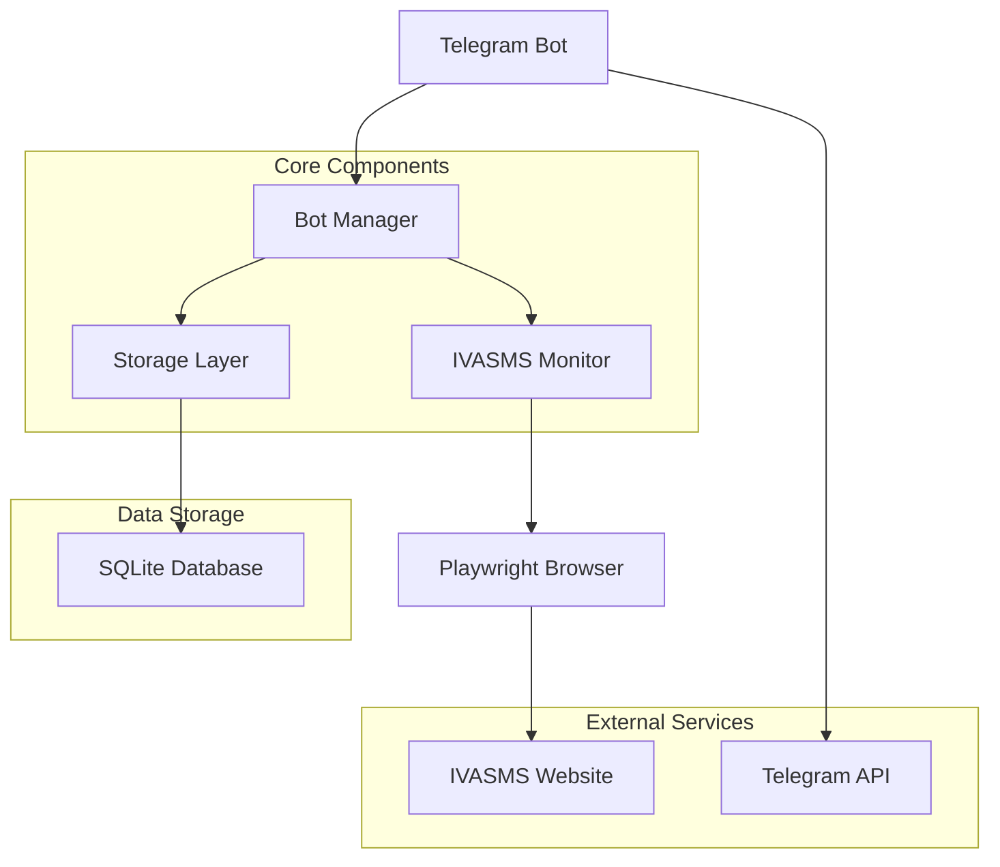

# Architecture Overview

This document describes the architecture and design decisions for the OTP Forwarder Bot.

## System Architecture



## Component Overview

### 1. Bot Manager (`src/main.py`)
- **Purpose**: Application lifecycle management
- **Responsibilities**:
  - Initialize and start all components
  - Handle graceful shutdown
  - Signal handling and error recovery
  - Process management

### 2. Telegram Bot (`src/bot.py`)
- **Purpose**: Telegram API integration and command handling
- **Responsibilities**:
  - Process incoming Telegram messages
  - Execute admin commands
  - Send notifications to admins
  - User authentication and authorization
- **Key Features**:
  - Admin-only command protection
  - Message formatting and delivery
  - Error handling and user feedback

### 3. IVASMS Monitor (`src/monitor.py`)
- **Purpose**: Web automation and SMS monitoring
- **Responsibilities**:
  - Login to IVASMS.com
  - Navigate to SMS statistics page
  - Monitor for new messages
  - Scrape message data
  - Handle popups and UI interactions
- **Key Features**:
  - Playwright-based automation
  - Robust error handling
  - Screenshot capture for debugging
  - Automatic retry mechanisms

### 4. Storage Layer (`src/storage.py`)
- **Purpose**: Data persistence and state management
- **Responsibilities**:
  - Store SMS messages
  - Track forwarding status
  - Maintain bot state
  - Export data for history requests
- **Key Features**:
  - SQLite database backend
  - Async operations
  - Data validation
  - Backup and recovery

### 5. Configuration (`src/config.py`)
- **Purpose**: Centralized configuration management
- **Responsibilities**:
  - Load environment variables
  - Parse configuration files
  - Provide secure access to credentials
  - Validate configuration values
- **Key Features**:
  - Environment-based configuration
  - Sensitive data protection
  - Validation and error handling

## Data Flow

### 1. Bot Startup
```
1. Load configuration from .env and config.yaml
2. Initialize storage layer
3. Start Telegram bot
4. Initialize Playwright browser
5. Login to IVASMS.com
6. Navigate to SMS page
7. Start monitoring loop
8. Send startup notification
```

### 2. SMS Monitoring
```
1. Poll SMS page every POLL_INTERVAL seconds
2. Scrape message elements from DOM
3. Compare with last seen message ID
4. Identify new messages
5. Save new messages to storage
6. Send notifications to admins
7. Update last seen ID
```

### 3. Command Processing
```
1. Receive Telegram message
2. Validate admin permissions
3. Execute command logic
4. Query storage if needed
5. Format response
6. Send reply to user
```

## Design Patterns

### 1. Dependency Injection
- Configuration is injected into components
- Storage is injected into monitor
- Promotes testability and modularity

### 2. Observer Pattern
- Monitor notifies bot of new messages
- Bot sends notifications to admins
- Loose coupling between components

### 3. State Machine
- Bot has clear states: stopped, starting, running, error
- Monitor has states: disconnected, logged in, monitoring
- State transitions are well-defined

### 4. Error Handling Strategy
- Graceful degradation on non-critical errors
- Automatic retry with exponential backoff
- Admin notifications for critical errors
- Comprehensive logging for debugging

## Security Considerations

### 1. Credential Management
- All sensitive data in environment variables
- No credentials in code or logs
- Sanitized configuration display

### 2. Access Control
- Admin-only commands protected by user ID verification
- Owner-only commands for critical operations
- Input validation and sanitization

### 3. Data Protection
- No PII in logs or error messages
- Secure storage of message data
- Automatic cleanup of temporary files

## Scalability Considerations

### 1. Horizontal Scaling
- Stateless bot design
- External storage for persistence
- Can run multiple instances with different admin groups

### 2. Performance Optimization
- Efficient DOM selectors
- Minimal polling frequency
- Async operations throughout
- Connection pooling for database

### 3. Resource Management
- Browser cleanup on shutdown
- Log rotation to prevent disk full
- Memory-efficient message storage

## Error Recovery

### 1. Automatic Recovery
- Browser crashes → Restart browser and re-login
- Network failures → Retry with backoff
- Login failures → Notify admin and retry

### 2. Manual Recovery
- Admin commands for restart
- Status monitoring
- Screenshot capture for debugging

### 3. Graceful Degradation
- Continue monitoring if non-critical errors occur
- Fallback to basic functionality
- Clear error messages to admins

## Testing Strategy

### 1. Unit Tests
- Individual component testing
- Mock external dependencies
- Configuration validation
- Storage operations

### 2. Integration Tests
- End-to-end bot functionality
- Mock Telegram API
- Mock Playwright interactions
- Database operations

### 3. Error Testing
- Network failure simulation
- Invalid input handling
- Resource exhaustion scenarios
- Security boundary testing

## Monitoring and Observability

### 1. Logging
- Structured logging with levels
- Request/response tracking
- Error context capture
- Performance metrics

### 2. Health Checks
- Bot status monitoring
- Login status verification
- Database connectivity
- External service availability

### 3. Alerting
- Critical error notifications
- Performance degradation alerts
- Security incident reporting
- Admin command execution logs

## Future Enhancements

### 1. Features
- Multiple website support
- Advanced filtering rules
- Message templates
- Webhook integration

### 2. Performance
- Caching layer
- Database optimization
- Async message processing
- Load balancing

### 3. Reliability
- Circuit breaker pattern
- Health check endpoints
- Automated testing
- Performance monitoring

This architecture provides a solid foundation for the OTP Forwarder Bot while maintaining flexibility for future enhancements and ensuring reliability in production environments.
